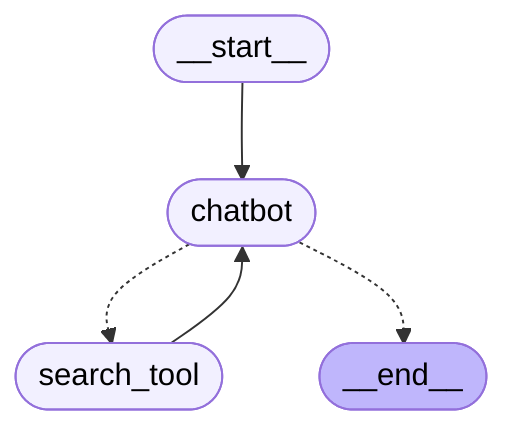

# Agentic Chatbot with LangGraph and Streamlit

This project implements an intelligent chatbot using the LangGraph framework and Streamlit for the frontend UI. The chatbot is designed to respond to user queries, maintain a conversation history, and integrate with external tools such as DuckDuckGo search.

<div align="center">



</div>

## Key Features

- **LangGraph Framework**: The project leverages LangGraph to create a state-based agentic framework. It allows the chatbot to maintain conversation history and dynamically use external tools when needed.
- **Integration with DuckDuckGo Search**: The chatbot is equipped with DuckDuckGo search capabilities, enabling it to fetch real-time information from the web.
- **Streamlit UI**: Streamlit is used for building an interactive frontend, enabling seamless chat interaction.
- **OpenAI Integration**: The chatbot uses OpenAI's GPT-4o-mini model to generate human-like responses to user queries.
- **Session History**: It maintains the chat history, providing context to the conversation, making the interaction feel more natural.

## Requirements

Before running the project, you need to install the necessary dependencies.

##### Python 3.8+ is required.

### Install Dependencies

```python
pip install -r requirements.txt
```

# Chatbot Application

Make sure to create a `.env` file in the root directory with your API keys:

```
OPENAI_API_KEY=<Your OpenAI API Key>
```

## Dependencies in `requirements.txt`
- `streamlit`
- `langchain`
- `langchain_openai`
- `langgraph`
- `duckduckgo-search`
- `openai`
- `python-dotenv`
- `langchain_community`

## Running the Chatbot

Once the dependencies are installed, you can run the chatbot using Streamlit. Follow these steps:

## Running the Chatbot

### Step 1: Start the Streamlit App
This will start the app and open it in your default web browser.

### Step 2: Interact with the Chatbot
Once the app is running, you can start chatting with the chatbot directly in the Streamlit UI. Type your question in the input field, and the chatbot will respond.
For example:
```
What's the temperature in New Delhi?
```

## File Structure

- `app.py`: The main application file with the Streamlit UI.
- `.env`: Contains the API key for OpenAI and other environment variables.
- `requirements.txt`: Contains the list of dependencies required to run the project.

## Notes
- Make sure to handle your OpenAI API key securely by storing it in the `.env` file.
- The `langgraph` library handles the conversation history and tool usage logic in the backend.
- The chatbot will use the DuckDuckGoSearchRun tool for searching the web for additional information. It's free and no API key is needed.
- You can modify or extend the functionality by adding more tools or customizing the chatbot logic.

